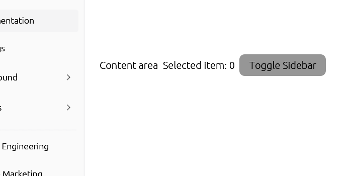

# Alert

Displays a callout for user attention.



## Usage

```rust
use egui_shadcn::{Alert, AlertVariant};

// Default informational alert
Alert::new(ui, AlertVariant::Default)
    .title("Heads up!")
    .description("You can add components to your app using the CLI.")
    .show();

// Destructive/error alert
Alert::new(ui, AlertVariant::Destructive)
    .title("Error")
    .description("Your session has expired. Please log in again.")
    .show();
```

## Variants

| Variant | Description |
|---------|-------------|
| `Default` | Informational message with neutral styling |
| `Destructive` | Error/warning message with red styling |

## API

```rust
impl<'a> Alert<'a> {
    pub fn new(ui: &'a mut Ui, variant: AlertVariant) -> Self;
    pub fn title(self, title: impl Into<String>) -> Self;
    pub fn description(self, description: impl Into<String>) -> Self;
    pub fn show(self) -> Response;
}
```

## Examples

### System Notification

```rust
Alert::new(ui, AlertVariant::Default)
    .title("New update available")
    .description("A new software update is available. Update now for the latest features.")
    .show();
```

### Error Message

```rust
Alert::new(ui, AlertVariant::Destructive)
    .title("Connection failed")
    .description("Unable to connect to the server. Please check your internet connection.")
    .show();
```

### Validation Feedback

```rust
fn show_form_alerts(ui: &mut Ui, errors: &[String]) {
    if !errors.is_empty() {
        Alert::new(ui, AlertVariant::Destructive)
            .title("Please fix the following errors:")
            .description(errors.join("\n"))
            .show();
    }
}
```

### Success Message

```rust
// Using default variant for success (green styling can be added)
Alert::new(ui, AlertVariant::Default)
    .title("Changes saved!")
    .description("Your profile has been updated successfully.")
    .show();
```
