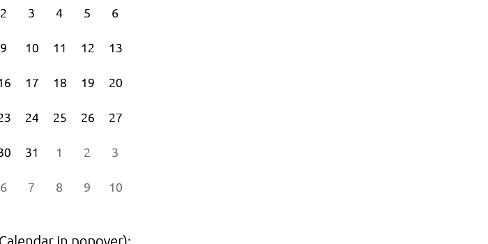

# Badge

Displays a badge or a component that looks like a badge.



## Usage

```rust
use egui_shadcn::{Badge, BadgeVariant};

// Default badge
ui.add(Badge::new("New"));

// Secondary badge
ui.add(Badge::new("Beta").variant(BadgeVariant::Secondary));

// Destructive badge
ui.add(Badge::new("Error").variant(BadgeVariant::Destructive));

// Outline badge
ui.add(Badge::new("Draft").variant(BadgeVariant::Outline));

// Notification count
ui.add(Badge::new("99+").variant(BadgeVariant::Destructive));
```

## Variants

| Variant | Description |
|---------|-------------|
| `Default` | Primary badge with solid background |
| `Secondary` | Muted badge with subtle styling |
| `Destructive` | Error/warning badge (red) |
| `Outline` | Border only, transparent background |

## API

```rust
impl Badge {
    pub fn new(text: impl Into<String>) -> Self;
    pub fn variant(self, variant: BadgeVariant) -> Self;
}

// Badge implements Widget trait
impl Widget for Badge {
    fn ui(self, ui: &mut Ui) -> Response;
}
```

## Examples

### Status Indicators

```rust
ui.horizontal(|ui| {
    ui.add(Badge::new("Active").variant(BadgeVariant::Default));
    ui.add(Badge::new("Pending").variant(BadgeVariant::Secondary));
    ui.add(Badge::new("Failed").variant(BadgeVariant::Destructive));
});
```

### Tags and Labels

```rust
ui.horizontal(|ui| {
    ui.add(Badge::new("Rust").variant(BadgeVariant::Outline));
    ui.add(Badge::new("egui").variant(BadgeVariant::Outline));
    ui.add(Badge::new("shadcn").variant(BadgeVariant::Outline));
});
```

### Notification Counts

```rust
ui.horizontal(|ui| {
    ui.label("Messages");
    ui.add(Badge::new("5").variant(BadgeVariant::Destructive));
});
```
