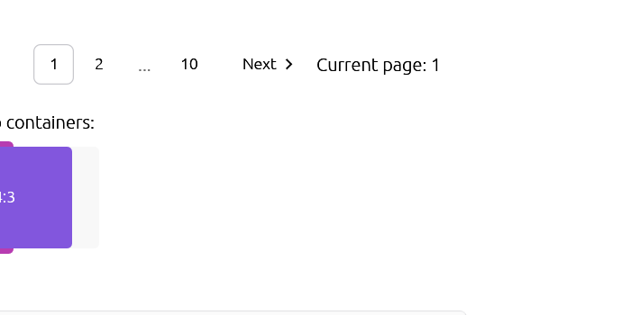

# Button

Displays a button or a component that looks like a button.



## Usage

```rust
use egui_shadcn::{Button, ButtonVariant, ButtonSize};

// Default button
if Button::new("Click me").show(ui).clicked() {
    println!("Clicked!");
}

// With variants
Button::new("Secondary").variant(ButtonVariant::Secondary).show(ui);
Button::new("Outline").variant(ButtonVariant::Outline).show(ui);
Button::new("Ghost").variant(ButtonVariant::Ghost).show(ui);
Button::new("Destructive").variant(ButtonVariant::Destructive).show(ui);
Button::new("Link").variant(ButtonVariant::Link).show(ui);

// With sizes
Button::new("Small").size(ButtonSize::Small).show(ui);
Button::new("Default").size(ButtonSize::Default).show(ui);
Button::new("Large").size(ButtonSize::Large).show(ui);
Button::new("Icon").size(ButtonSize::Icon).show(ui);

// Disabled
Button::new("Disabled").enabled(false).show(ui);
```

## Variants

| Variant | Description |
|---------|-------------|
| `Default` | Primary action button with solid background |
| `Secondary` | Secondary action with muted background |
| `Outline` | Border only, transparent background |
| `Ghost` | No border or background until hovered |
| `Destructive` | Dangerous/delete actions (red) |
| `Link` | Appears as a text link |

## Sizes

| Size | Height | Use Case |
|------|--------|----------|
| `Small` | 36px | Compact UIs, toolbars |
| `Default` | 44px | Standard buttons |
| `Large` | 50px | Primary CTAs |
| `Icon` | 44px | Icon-only buttons |

## API

```rust
impl Button {
    pub fn new(text: impl Into<String>) -> Self;
    pub fn variant(self, variant: ButtonVariant) -> Self;
    pub fn size(self, size: ButtonSize) -> Self;
    pub fn enabled(self, enabled: bool) -> Self;
    pub fn show(self, ui: &mut Ui) -> Response;
}
```

## Examples

### Form Submit Button

```rust
ui.horizontal(|ui| {
    if Button::new("Cancel")
        .variant(ButtonVariant::Outline)
        .show(ui)
        .clicked()
    {
        // Handle cancel
    }

    if Button::new("Save Changes").show(ui).clicked() {
        // Handle save
    }
});
```

### Destructive Action

```rust
if Button::new("Delete Account")
    .variant(ButtonVariant::Destructive)
    .show(ui)
    .clicked()
{
    show_confirmation_dialog = true;
}
```

### Icon Button

```rust
// Using text as icon placeholder
Button::new("+")
    .size(ButtonSize::Icon)
    .variant(ButtonVariant::Outline)
    .show(ui);
```
