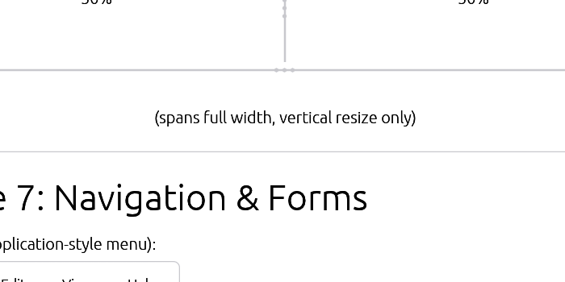

# Card

Displays a card with header, content, and footer.



## Usage

```rust
use egui_shadcn::{Card, card_title, card_description};

// Simple card with content
Card::new(ui)
    .content(|ui| {
        ui.label("Hello, card!");
    })
    .show();

// Full card with all sections
Card::new(ui)
    .header(|ui| {
        card_title(ui, "Card Title");
        card_description(ui, "Card description goes here.");
    })
    .content(|ui| {
        ui.label("Main content area");
    })
    .footer(|ui| {
        if Button::new("Action").show(ui).clicked() {
            // Handle click
        }
    })
    .show();

// Disable hover effect
Card::new(ui)
    .hoverable(false)
    .content(|ui| {
        ui.label("Static card without hover effect");
    })
    .show();
```

## Features

- **Structured Layout**: Header, content, and footer sections
- **Hover Effect**: Subtle border highlight on mouse hover
- **Theme Integration**: Uses theme colors, shadows, and spacing
- **Flexible Content**: Each section accepts any UI content

## API

```rust
impl<'a> Card<'a> {
    pub fn new(ui: &'a mut Ui) -> Self;
    pub fn hoverable(self, hoverable: bool) -> Self;
    pub fn header(self, header: impl FnOnce(&mut Ui) + 'a) -> Self;
    pub fn content(self, content: impl FnOnce(&mut Ui) + 'a) -> Self;
    pub fn footer(self, footer: impl FnOnce(&mut Ui) + 'a) -> Self;
    pub fn show(self) -> Response;
}

// Helper functions
pub fn card_title(ui: &mut Ui, text: impl Into<String>);
pub fn card_description(ui: &mut Ui, text: impl Into<String>);
```

## Examples

### User Profile Card

```rust
Card::new(ui)
    .header(|ui| {
        ui.horizontal(|ui| {
            ui.add(Avatar::new("John Doe").size(AvatarSize::Large));
            ui.vertical(|ui| {
                card_title(ui, "John Doe");
                card_description(ui, "@johndoe");
            });
        });
    })
    .content(|ui| {
        ui.label("Software developer. Rust enthusiast. Building cool things.");
    })
    .footer(|ui| {
        ui.horizontal(|ui| {
            Button::new("Follow").show(ui);
            Button::new("Message")
                .variant(ButtonVariant::Outline)
                .show(ui);
        });
    })
    .show();
```

### Stats Card

```rust
Card::new(ui)
    .content(|ui| {
        ui.vertical_centered(|ui| {
            ui.heading("1,234");
            ui.label("Total Users");
        });
    })
    .show();
```

### Settings Card

```rust
Card::new(ui)
    .header(|ui| {
        card_title(ui, "Notifications");
        card_description(ui, "Configure how you receive notifications.");
    })
    .content(|ui| {
        Switch::new(&mut email_notifications)
            .label("Email notifications")
            .ui(ui);
        Switch::new(&mut push_notifications)
            .label("Push notifications")
            .ui(ui);
    })
    .footer(|ui| {
        ui.horizontal(|ui| {
            Button::new("Cancel")
                .variant(ButtonVariant::Ghost)
                .show(ui);
            Button::new("Save").show(ui);
        });
    })
    .show();
```

### Loading Card

```rust
fn show_card_skeleton(ui: &mut Ui) {
    Card::new(ui)
        .hoverable(false)
        .content(|ui| {
            ui.horizontal(|ui| {
                ui.add(Skeleton::circle(48.0));
                ui.vertical(|ui| {
                    ui.add(Skeleton::new(Vec2::new(120.0, 16.0)));
                    ui.add(Skeleton::new(Vec2::new(80.0, 14.0)));
                });
            });
        })
        .show();
}
```
