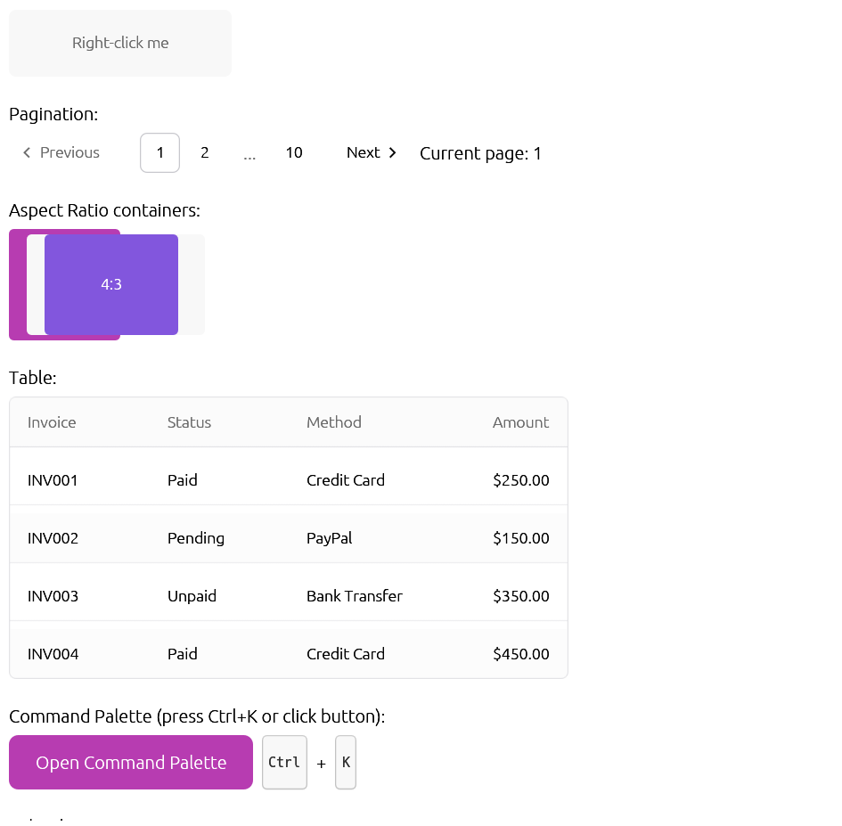

# egui_shadcn Component Library

A complete port of [shadcn/ui](https://ui.shadcn.com) to [egui](https://github.com/emilk/egui), built for [notedeck](https://github.com/damus-io/notedeck).


## Quick Start

```rust
use egui_shadcn::NotedeckTheme;

impl eframe::App for MyApp {
    fn update(&mut self, ctx: &egui::Context, _frame: &mut eframe::Frame) {
        // Apply theme (enables all shadcn styling)
        NotedeckTheme::apply(ctx, self.dark_mode);

        egui::CentralPanel::default().show(ctx, |ui| {
            // Your UI with shadcn styling!
        });
    }
}
```

## Installation

Add to your `Cargo.toml`:

```toml
[dependencies]
egui_shadcn = { git = "https://github.com/alltheseas/shadcn-egui-notedeck" }
```

## Components

### Core Components
| Component | Description |
|-----------|-------------|
| [Button](components/button.md) | Clickable button with 6 variants and 4 sizes |
| [Badge](components/badge.md) | Status labels with 4 variants |
| [Avatar](components/avatar.md) | User profile images with auto-initials |
| [Card](components/card.md) | Content containers with header/content/footer |
| [Alert](components/alert.md) | Informational messages (default, destructive) |
| [Skeleton](components/skeleton.md) | Animated loading placeholders |
| [Kbd](components/kbd.md) | Keyboard shortcut display |
| [Separator](components/separator.md) | Horizontal/vertical dividers |

### Form Components
| Component | Description |
|-----------|-------------|
| [Input](components/input.md) | Text input fields with validation states |
| [Checkbox](components/checkbox.md) | Square checkboxes with indeterminate state |
| [Switch](components/switch.md) | Toggle switches |
| [Slider](components/slider.md) | Range input sliders |
| [Progress](components/progress.md) | Progress bars |
| [Radio](components/radio.md) | Radio button groups |

### Navigation
| Component | Description |
|-----------|-------------|
| [Tabs](components/tabs.md) | Tabbed interfaces with underline indicator |

### Overlays
| Component | Description |
|-----------|-------------|
| [Dialog](components/dialog.md) | Modal dialogs with backdrop |

### Data Display
| Component | Description |
|-----------|-------------|
| [Spinner](components/spinner.md) | Animated loading spinners |

## Design System

### Colors
- **Primary**: Notedeck purple (`#CC43C5`)
- **Secondary**: Muted backgrounds
- **Destructive**: Error/danger states
- **Accent**: Hover/focus states

### Spacing Scale
| Token | Pixels |
|-------|--------|
| `xs` | 4px |
| `sm` | 8px |
| `md` | 16px |
| `lg` | 24px |
| `xl` | 32px |
| `2xl` | 48px |

### Corner Radii
| Token | Pixels |
|-------|--------|
| `sm` | 4px |
| `md` | 6px |
| `lg` | 8px |
| `xl` | 12px |
| `2xl` | 16px |
| `full` | 9999px |

### Shadows
Elevation levels: `xs`, `sm`, `md`, `lg`, `xl`, `2xl`

## Accessibility

- **WCAG AA Compliant**: 4.5:1 minimum contrast ratios
- **Apple HIG**: 44px minimum touch targets
- **Keyboard Navigation**: Focus indicators on all interactive elements

## Testing

```bash
# Run the interactive showcase
cargo run -p egui_shadcn --example showcase

# Run unit tests
cargo test -p egui_shadcn
```

## Screenshots

| Light Mode | Dark Mode |
|------------|-----------|
|  |  |

## References

- [notedeck](https://github.com/damus-io/notedeck) - Cross-platform nostr client
- [shadcn/ui](https://ui.shadcn.com) - Original design system
- [egui](https://github.com/emilk/egui) - Target GUI framework
